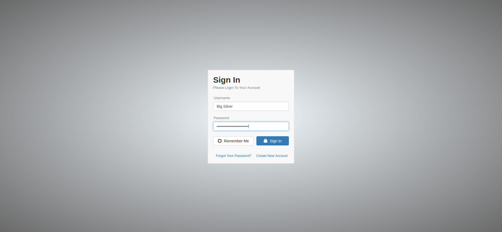
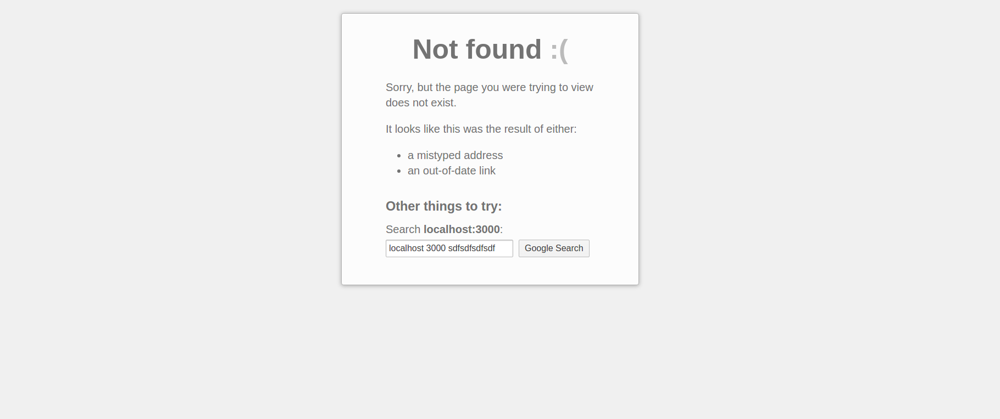

# Node Authentication



## About

* New User Account Creation
* Secure Password Reset via Email
* Ability to Update / Delete Account
* Session Tracking for Logged-In Users
* Local Cookie Storage for Returning Users
* Blowfish-based Scheme Password Encryption

This project is written by [Big-Silver].

## Node-Auth is built the following libraries :

* [Node.js](http://nodejs.org/) - Application Server
* [Express.js](http://expressjs.com/) - Node.js Web Framework
* [MongoDb](http://mongodb.org/) - Database Storage
* [Jade](http://jade-lang.com/) - HTML Templating Engine
* [Stylus](http://stylus-lang.com/) - CSS Preprocessor
* [EmailJS](http://github.com/eleith/emailjs) - Node.js > SMTP Server Middleware
* [Moment.js](http://momentjs.com/) - Lightweight Date Library
* [Twitter Bootstrap](http://twitter.github.com/bootstrap/) - UI Component & Layout Library

## Install
Install [Node.js](https://nodejs.org/) & [MongoDB](https://www.mongodb.org/)

## Quick Start

```bash
# clone our repo
$ git clone https://github.com/Big-Silver/Node-Authentication.git node-auth

# change directory to your app
$ cd node-auth

# install the dependencies with npm
$ npm install

# start the Mongodb
$ mongod

# start the app
$ node app.js

Open a browser window and navigate to: [http://localhost:3000](http://localhost:3000)

```

## 404 error

